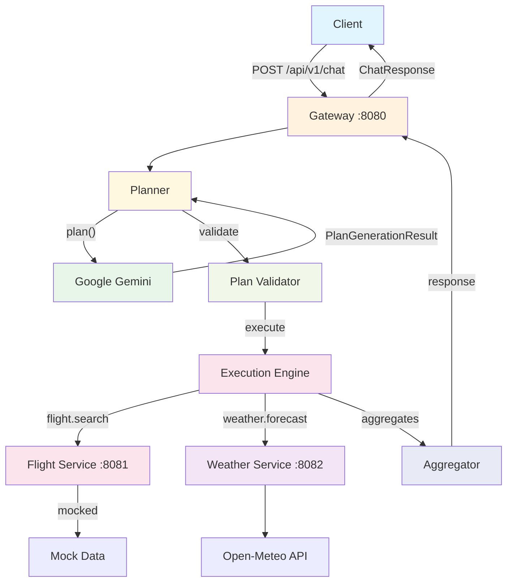
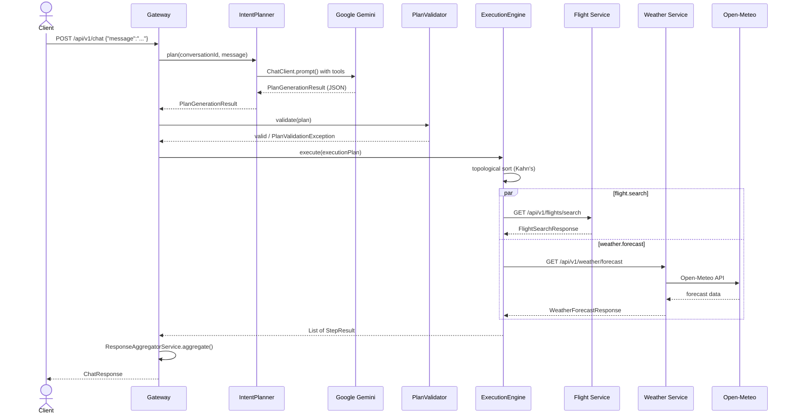

# AI Orchestration Platform

An AI-powered orchestration platform that accepts natural language requests, plans multi-step workflows using Google Gemini, executes them across downstream services in parallel, and aggregates the results.

## Architecture



## How It Works

1. **Client** sends a natural language request to the gateway (e.g. "Book a flight from Bangalore to Tokyo tomorrow and check the weather").
2. **Planner** sends the request to Google Gemini with a structured prompt. Gemini returns an `ExecutionPlan` containing ordered steps with tool calls and arguments.
3. **Validator** checks confidence, tool existence, argument completeness, and dependency graph validity.
4. **Execution Engine** topologically sorts the DAG and executes independent steps concurrently via `CompletableFuture` + `ThreadPoolTaskExecutor`.
5. **Downstream services** (`flight-service`, `weather-service`) handle individual tool requests.
6. **Aggregator** combines all step results into a structured response with per-step status and latency.

When the AI planner is disabled, a deterministic fallback factory creates a hardcoded plan based on keyword matching.

## Request Lifecycle



## Features

- **AI planning** - Google Gemini generates execution plans from natural language
- **Deterministic fallback** - keyword-based planning when AI planner is disabled
- **Tool orchestration** - flight search and weather forecast tools
- **Conversation memory** - multi-turn chat with TTL-based conversation eviction
- **Relative date resolution** - Gemini can resolve "today", "tomorrow", "next Friday" during planning
- **Execution DAG** - steps can declare dependencies; the engine respects the dependency graph
- **Parallel execution** - independent steps run concurrently
- **Plan validation** - confidence threshold, tool existence, argument completeness, cycle detection
- **Structured logging** - Log4j2 JSON layout with trace and conversation IDs
- **Virtual threads** - Spring Boot virtual threads enabled
- **Trace propagation** - `X-Trace-Id` header across all services
- **Configuration** - fully externalized via environment variables

## Design Principles

Each concern is owned by exactly one component:

- **Planner** generates an execution plan from natural language. It does not execute tools, validate arguments, or aggregate results.
- **Validator** checks plan structure, confidence, tool existence, argument completeness, and dependency graph correctness. It does not modify the plan.
- **Execution Engine** topologically sorts steps and runs them via `CompletableFuture`, respecting the dependency DAG. It does not interpret step results.
- **Downstream services** own their business logic and data sources. The gateway never duplicates service-level validation or data access.
- **Aggregator** combines step results into the final response. It does not re-execute or re-validate steps.

## Technology Stack

| Category | Technology |
|----------|-----------|
| Language | Java 23 |
| Framework | Spring Boot 4.0.7 |
| AI SDK | Spring AI 2.0.0 (Google GenAI) |
| LLM | Google Gemini (default: `gemini-2.5-flash-lite`) |
| HTTP Client | Spring `RestClient` using `java.net.http.HttpClient` |
| Concurrency | `CompletableFuture` + `ThreadPoolTaskExecutor` |
| Validation | Jakarta Bean Validation |
| Logging | Log4j2 with JSON template layout |
| Build | Apache Maven (multi-module) |
| Monitoring | Spring Boot Actuator (health, info, metrics) |
| API Docs | SpringDoc OpenAPI 3.0.0 |
| External APIs | Open-Meteo (free weather, no auth required) |

## Prerequisites

- JDK 23 (Temurin recommended)
- Apache Maven 3.9+
- Google Gemini API key

## Environment Variables

| Variable | Default | Description | Service |
|----------|---------|-------------|---------|
| `GEMINI_API_KEY` | - | Google Gemini API key (required) | gateway |
| `GEMINI_MODEL` | `gemini-2.5-flash-lite` | Gemini model name | gateway |
| `AI_PLANNER_ENABLED` | `true` | Enable/disable AI planner | gateway |
| `FLIGHT_SERVICE_BASE_URL` | `http://localhost:8081` | Flight service base URL | gateway |
| `WEATHER_SERVICE_BASE_URL` | `http://localhost:8082` | Weather service base URL | gateway |
| `HTTP_CONNECT_TIMEOUT` | `10s` | Downstream HTTP connect timeout | gateway |
| `HTTP_READ_TIMEOUT` | `15s` | Downstream HTTP read timeout | gateway |
| `EXECUTION_POOL_CORE_SIZE` | `4` | Thread pool core size | gateway |
| `EXECUTION_POOL_MAX_SIZE` | `8` | Thread pool max size | gateway |
| `EXECUTION_POOL_QUEUE_CAPACITY` | `50` | Thread pool queue capacity | gateway |
| `CHAT_MEMORY_MAX_MESSAGES` | `30` | Max messages per conversation | gateway |
| `CHAT_MEMORY_TTL_MINUTES` | `30` | Conversation idle TTL (minutes) | gateway |
| `CHAT_MEMORY_CLEANUP_INTEVAL` | `300000` | Stale conversation cleanup interval (ms) | gateway |
| `PLANNING_CLARIFICATION_THRESHOLD` | `0.5` | Minimum confidence for execution | gateway |
| `PLANNING_MINIMUM_CONFIDENCE` | `0.5` | Minimum plan confidence threshold | gateway |
| `WEATHER_MAX_DAYS_AHEAD` | `16` | Max forecast days from today | weather-service |
| `OPEN_METEO_GEOCODING_URL` | `https://geocoding-api.open-meteo.com/v1/search` | Open-Meteo geocoding endpoint | weather-service |
| `OPEN_METEO_FORECAST_URL` | `https://api.open-meteo.com/v1/forecast` | Open-Meteo forecast endpoint | weather-service |

## Running Locally

Set your Gemini API key and build the project:

```bash
export GEMINI_API_KEY=your-key-here
mvn clean install -DskipTests
```

Start each service in a separate terminal (flight-service and weather-service can start in any order; gateway requires both to be running):

```bash
# Terminal 1 - flight-service (port 8081)
mvn spring-boot:run -pl flight-service

# Terminal 2 - weather-service (port 8082)
mvn spring-boot:run -pl weather-service

# Terminal 3 - gateway (port 8080)
mvn spring-boot:run -pl gateway
```

| Service | Port | Default Base URL |
|---------|------|------------------|
| Gateway | 8080 | - |
| Flight Service | 8081 | `http://localhost:8081` |
| Weather Service | 8082 | `http://localhost:8082` |

## Example API Request

```bash
curl -X POST http://localhost:8080/api/v1/chat \
  -H "Content-Type: application/json" \
  -H "X-Conversation-Id: my-session-1" \
  -d '{"message": "Book a flight from BLR to NRT tomorrow and check the weather in Tokyo"}'
```

### Example Response

```json
{
  "partialSuccess": false,
  "completedSteps": ["step-1", "step-2"],
  "failedSteps": [],
  "executionTrace": [
    {
      "stepId": "step-1",
      "tool": "flight.search",
      "status": "SUCCESS",
      "data": {
        "flights": [
          {
            "flightNumber": "AF123",
            "origin": "BLR",
            "destination": "NRT",
            "departureDate": "2026-06-24",
            "departureTime": "01:30",
            "status": "On Time"
          }
        ]
      },
      "error": null,
      "latencyMs": 120
    },
    {
      "stepId": "step-2",
      "tool": "weather.forecast",
      "status": "SUCCESS",
      "data": {
        "location": "Tokyo",
        "date": "2026-06-24",
        "temperatureCelsius": 22.5,
        "condition": "Partly Cloudy",
        "humidityPercent": 65,
        "windSpeedKph": 12.3
      },
      "error": null,
      "latencyMs": 340
    }
  ],
  "response": {
    "step-1": {
      "flights": [
        {
          "flightNumber": "AF123",
          "origin": "BLR",
          "destination": "NRT",
          "departureDate": "2026-06-24",
          "departureTime": "01:30",
          "status": "On Time"
        }
      ]
    },
    "step-2": {
      "location": "Tokyo",
      "date": "2026-06-24",
      "temperatureCelsius": 22.5,
      "condition": "Partly Cloudy",
      "humidityPercent": 65,
      "windSpeedKph": 12.3
    }
  },
  "summary": "Searched for flights from BLR to NRT on 2026-06-24 and retrieved the Tokyo weather forecast.",
  "clarificationRequired": false,
  "clarificationMessage": null
}
```

## Repository Modules

```
ai-orchestration-platform/
├── pom.xml                  # Parent POM (Spring Boot 4.0.7, Java 23)
├── platform-common/         # Shared library
├── gateway/                 # API gateway, planner, execution engine
├── flight-service/          # Flight search service
└── weather-service/         # Weather forecast service
```

| Module | Type | Responsibility |
|--------|------|----------------|
| `platform-common` | JAR | Shared infrastructure: `TraceIdFilter`, `ErrorResponse` DTO, `ConversationContext` (MDC), `Headers` constants. Has no Spring Boot dependency - a lightweight library used by all services. |
| `gateway` | Spring Boot (port 8080) | API entry point. Houses the chat controller, AI planner (`IntentPlannerService`), deterministic fallback, plan validator, execution engine, downstream HTTP clients (`FlightClient`, `WeatherClient`), response aggregator, chat memory, and all tool/planner configuration. |
| `flight-service` | Spring Boot (port 8081) | Flight search microservice. Input validation, mocked `AmadeusClient`, structured error handling. Deterministic mock data - see note below. |
| `weather-service` | Spring Boot (port 8082) | Weather forecast microservice. Real Open-Meteo integration via geocoding + forecast APIs, date constraint validation, WMO code mapping. |

The flight-service uses deterministic mock data by design. This project focuses on demonstrating AI orchestration, planning, and Spring AI integration rather than integrating with third-party flight providers. Real providers such as Amadeus can be integrated with minimal architectural changes.

## Documentation

| Resource | Description |
|----------|-------------|
| [gateway/README.md](gateway/README.md) | Gateway architecture, planning flow, key components, feature flag |
| [flight-service/README.md](flight-service/README.md) | Flight service endpoint, mocked data, architecture |
| [weather-service/README.md](weather-service/README.md) | Weather service endpoint, Open-Meteo integration, validation |
| [CONTRIBUTING.md](CONTRIBUTING.md) | Setup guide, branch naming, commit conventions, PR workflow |
| [SECURITY.md](SECURITY.md) | Security policy and vulnerability reporting |
| [docs/postman/](docs/postman/) | Postman collection for API testing |

## Future Improvements

- Multi-modal input support
- Streaming responses via SSE
- Circuit breaker for downstream services

## License

This project is licensed under the Apache License, Version 2.0. See the [LICENSE](LICENSE) file for details.
