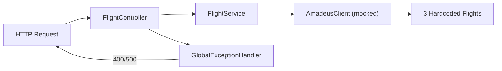

# Flight Service

A microservice that provides flight search capabilities for the AI Orchestration Platform. Uses deterministic mock data - this project focuses on AI orchestration rather than third-party flight API integration.

## Responsibilities

- Expose `GET /api/v1/flights/search` for flight searching
- Validate search parameters (origin, destination, departure date) via Jakarta Bean Validation
- Return structured flight search results

## Endpoint

```
GET /api/v1/flights/search?origin=BLR&destination=NRT&departureDate=2026-06-24
```

### Parameters

| Parameter | Type | Description |
|-----------|------|-------------|
| `origin` | String | IATA airport code (e.g. BLR, NRT, JFK) |
| `destination` | String | IATA airport code |
| `departureDate` | LocalDate | Departure date (ISO-8601) |

### Response

```json
{
  "flights": [
    {
      "airline": "Air France",
      "flightNumber": "AF123",
      "origin": "BLR",
      "destination": "NRT",
      "departureDate": "2026-06-24",
      "price": 850.0,
      "currency": "USD"
    }
  ]
}
```

## Architecture



| Layer | Responsibility |
|-------|----------------|
| `FlightController` | Input validation via Jakarta Bean Validation |
| `FlightService` | Business logic, delegates to client |
| `AmadeusClient` | External API abstraction; currently returns 3 hardcoded flights (Air France, Lufthansa, Delta) with realistic pricing |
| `GlobalExceptionHandler` | Maps exceptions to appropriate HTTP statuses |

## Data Source

The service uses **mocked data** by design. `AmadeusClient` returns three hardcoded flight results with realistic pricing. The `RestClient.Builder` bean is wired and ready for real Amadeus API integration - implementing a live provider requires only a new client implementation.

## Configuration

| Variable | Default | Description |
|----------|---------|-------------|
| `SERVER_PORT` | `8006` | HTTP listen port |
| `HTTP_CONNECT_TIMEOUT` | `5s` | Downstream HTTP connect timeout |
| `HTTP_READ_TIMEOUT` | `10s` | Downstream HTTP read timeout |
