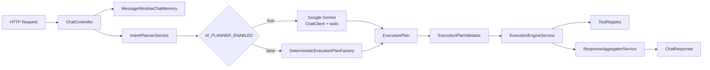

# Gateway

The central entry point for the AI Orchestration Platform. Accepts natural language requests and coordinates AI planning, validation, execution, and response aggregation.

## Responsibilities

- Expose `POST /api/v1/chat` as the sole public endpoint
- Manage conversation context and chat memory (`MessageWindowChatMemory` with TTL-based eviction)
- Generate execution plans via Google Gemini (AI mode) or keyword matching (deterministic fallback)
- Validate plans for confidence, tool existence, argument completeness, and DAG correctness
- Execute plans by calling downstream services in dependency order
- Aggregate step results into a structured `ChatResponse`

## Planning Flow

## Key Components

| Component | Description |
|-----------|-------------|
| `ChatController` | REST endpoint, resolves conversation ID, delegates to `ChatService` |
| `ChatService` | Orchestrates the plan → validate → execute → aggregate pipeline |
| `IntentPlannerService` | Calls Gemini with planning prompt, parses JSON response via `BeanOutputConverter` |
| `PromptProvider` | Builds the Gemini system prompt with tool definitions and planning rules |
| `DeterministicExecutionPlanFactory` | Fallback planner when AI is disabled; keyword-based plan generation |
| `ExecutionPlanValidator` | 8 validation rules including confidence threshold, tool existence, cycle detection |
| `ExecutionEngineService` | Topological sort (Kahn's), concurrent execution via `CompletableFuture` |
| `ToolExecutor` | Functional interface for step execution |
| `ToolRegistry` | Maps tool names to required argument sets |
| `FlightClient` | HTTP client for flight-service |
| `WeatherClient` | HTTP client for weather-service |
| `ResponseAggregatorService` | Builds `ChatResponse` from plan summary and step results |

## Spring AI Integration

| Component | Purpose |
|-----------|---------|
| `ChatClient` | Configured with `MessageChatMemoryAdvisor` for multi-turn conversation context |
| `ResolveRelativeDateTool` | Registered as a Gemini `@Tool` for resolving relative dates during planning |
| `BeanOutputConverter<PlanGenerationResult>` | Parses Gemini's structured JSON response into a typed plan |
| `MessageWindowChatMemory` | In-memory chat history with configurable max messages and TTL-based eviction |

## Configuration

| Variable | Default | Description |
|----------|---------|-------------|
| `AI_PLANNER_ENABLED` | `true` | Enable AI planner; when `false`, uses keyword-based fallback |
| `GEMINI_API_KEY` | - | Google Gemini API key (required when AI planner is enabled) |
| `GEMINI_MODEL` | `gemini-2.5-flash-lite` | Gemini model name |

When AI planner is disabled, the `DeterministicExecutionPlanFactory` handles requests using keyword matching (detects "flight" and "weather" keywords) and returns hardcoded plans. This mode requires no API key.
