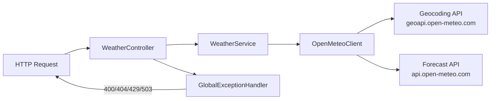

# Weather Service

A microservice that provides weather forecast data for the AI Orchestration Platform. Integrates with the free [Open-Meteo API](https://open-meteo.com/) - no API key required.

## Responsibilities

- Expose `GET /api/v1/weather/forecast` for weather forecasts
- Resolve location names to coordinates via Open-Meteo Geocoding API
- Fetch and normalize weather data from Open-Meteo Forecast API
- Enforce date constraints (no past dates, within configurable forecast window)

## Endpoint

```
GET /api/v1/weather/forecast?location=Tokyo&date=2026-06-24
```

### Parameters

| Parameter | Type | Constraints | Description |
|-----------|------|-------------|-------------|
| `location` | String | - | City name (e.g. Tokyo, London, New York) |
| `date` | LocalDate | Not in the past; max 16 days ahead | Forecast date (ISO-8601) |

### Response

```json
{
  "location": "Tokyo",
  "date": "2026-06-24",
  "temperatureCelsius": 22.5,
  "condition": "Partly Cloudy",
  "humidityPercent": 65,
  "windSpeedKph": 12.3
}
```

## Open-Meteo Integration

The service makes two calls to Open-Meteo:

1. **Geocoding** - `https://geocoding-api.open-meteo.com/v1/search?name={location}` resolves a city name to latitude/longitude coordinates
2. **Forecast** - `https://api.open-meteo.com/v1/forecast?latitude={lat}&longitude={lon}&daily=temperature_2m_max,temperature_2m_min,weather_code,wind_speed_10m_max&hourly=relative_humidity_2m` fetches weather data

WMO weather codes are mapped to human-readable conditions (e.g. code 61 → "Rain", code 0 → "Clear Sky").

## Architecture



| Layer | Responsibility |
|-------|----------------|
| `WeatherController` | Input validation via Jakarta Bean Validation |
| `WeatherService` | Business logic, date constraint enforcement |
| `OpenMeteoClient` | HTTP calls to Open-Meteo APIs and response mapping (WMO code → condition) |
| `GlobalExceptionHandler` | Maps exceptions to appropriate HTTP statuses (400, 404, 429, 503) |

## Validation Rules

- Date must not be in the past
- Date must be within the configurable forecast window (default 16 days ahead)
- Location must be resolvable to valid coordinates
- All error responses include structured `ErrorResponse` JSON

## Configuration

| Variable | Default | Description |
|----------|---------|-------------|
| `SERVER_PORT` | `8007` | HTTP listen port |
| `HTTP_CONNECT_TIMEOUT` | `10s` | Downstream HTTP connect timeout |
| `HTTP_READ_TIMEOUT` | `15s` | Downstream HTTP read timeout |
| `WEATHER_MAX_DAYS_AHEAD` | `16` | Max forecast days from today |
| `OPEN_METEO_GEOCODING_URL` | `https://geocoding-api.open-meteo.com/v1/search` | Open-Meteo geocoding endpoint |
| `OPEN_METEO_FORECAST_URL` | `https://api.open-meteo.com/v1/forecast` | Open-Meteo forecast endpoint |
